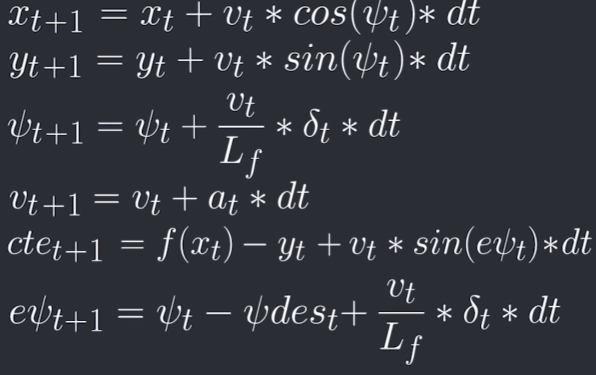
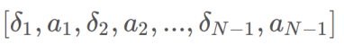

# CarND-Controls-MPC
Self-Driving Car Engineer Nanodegree Program

---

## Dependencies

* cmake >= 3.5
 * All OSes: [click here for installation instructions](https://cmake.org/install/)
* make >= 4.1(mac, linux), 3.81(Windows)
  * Linux: make is installed by default on most Linux distros
  * Mac: [install Xcode command line tools to get make](https://developer.apple.com/xcode/features/)
  * Windows: [Click here for installation instructions](http://gnuwin32.sourceforge.net/packages/make.htm)
* gcc/g++ >= 5.4
  * Linux: gcc / g++ is installed by default on most Linux distros
  * Mac: same deal as make - [install Xcode command line tools]((https://developer.apple.com/xcode/features/)
  * Windows: recommend using [MinGW](http://www.mingw.org/)
* [uWebSockets](https://github.com/uWebSockets/uWebSockets)
  * Run either `install-mac.sh` or `install-ubuntu.sh`.
  * If you install from source, checkout to commit `e94b6e1`, i.e.
    ```
    git clone https://github.com/uWebSockets/uWebSockets
    cd uWebSockets
    git checkout e94b6e1
    ```
    Some function signatures have changed in v0.14.x. See [this PR](https://github.com/udacity/CarND-MPC-Project/pull/3) for more details.

* **Ipopt and CppAD:** Please refer to [this document](https://github.com/udacity/CarND-MPC-Project/blob/master/install_Ipopt_CppAD.md) for installation instructions.
* [Eigen](http://eigen.tuxfamily.org/index.php?title=Main_Page). This is already part of the repo so you shouldn't have to worry about it.
* Simulator. You can download these from the [releases tab](https://github.com/udacity/self-driving-car-sim/releases).
* Not a dependency but read the [DATA.md](./DATA.md) for a description of the data sent back from the simulator.


## Basic Build Instructions

1. Clone this repo.
2. Make a build directory: `mkdir build && cd build`
3. Compile: `cmake .. && make`
4. Run it: `./mpc`.

## The Model
One approach to writing a good controller is to first model the vehicle's dynamics and constraints. That way, we can analyze and tune the controller more efficiently. Typically, more realistic models are also more complex and more challenging to work with, so there's always a trade-off to make.

I’ve used a relatively simple type of model, the kinematic model. Kinematic models are simplifications of dynamic models that ignore tire forces, gravity, and mass. This simplification reduces the accuracy of the models, but it also makes them more tractable. At low and moderate speeds, kinematic models often approximate the actual vehicle dynamics.
It can be described as following equations.:


## Timestamp Length (N), Elapsed Duration (dt)
In the case of a car, Prediction Horizon (N x dt) should be a few seconds, at most. Beyond that horizon, the environment will change enough that it won't make sense to predict any further into the future.
The goal of Model Predictive Control is to optimize the control inputs: [δ,a]. An optimizer will tune these inputs until a low cost vector of control inputs is found. The length of this vector is determined by N:


Thus N determines the number of variables optimized by the MPC. This is also the major driver of computational cost.

MPC attempts to approximate a continuous reference trajectory by means of discrete paths between actuations. Larger values of dt result in less frequent actuations, which makes it harder to accurately approximate a continuous reference trajectory.

My approach to setting N, dt, was is to first determine a reasonable range Prediction Horizon, i.e 1~2 sec and then tune dt and
```
The following values work:
N = 10, dt = 0.1
N = 20, dt = 0.1

The following did not work:
N = 5, dt = 0.15
N = 10, dt = 0.05
N = 20, dt = 0.05
```

## MPC Preprocessing
Once I receive waypoints from simulator, I make following simplifications. I subtract the points form car’s current position. That means x and y coordinates will be at zero. To make psi zero, I rotate all of waypoints about the origin. This helps with the polynomial fit because most the time car would be at the same orientation as the line. This keeps polynomial fit happy because it does not like vertical lines. This also helps with the mathematics of MPC evaluation, evaluate cte and simplifies transitions ins general.

## Latency
In a real car, an actuation command won't execute instantly. There will be a delay as the command propagates through the system. A realistic delay might be on the order of 100 milliseconds. 
My solution was to run a simulation using the vehicle model starting from the current state for the duration of the latency. The resulting state from the simulation is the new initial state for MPC.
Previously, I made x,y,psi all zero This means x + v* cos(psi)*dt simplifies to v* dt and  y + v*sin(psi)*dt simplifies to zero.


